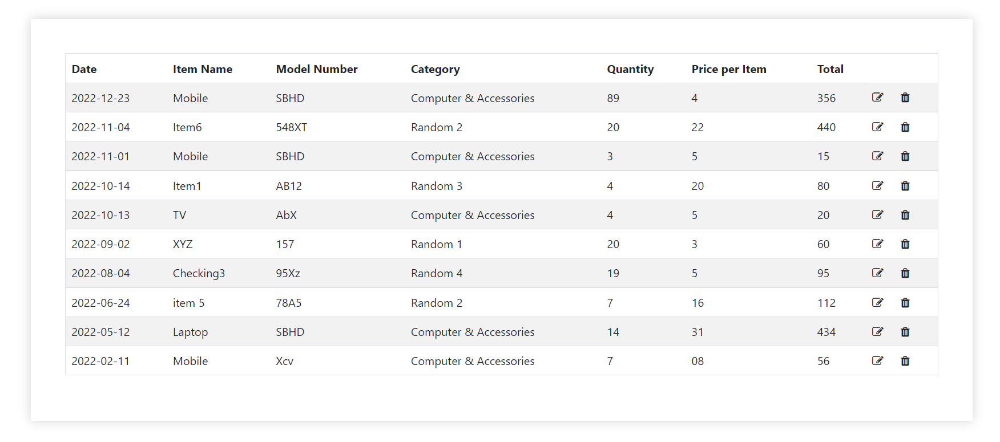
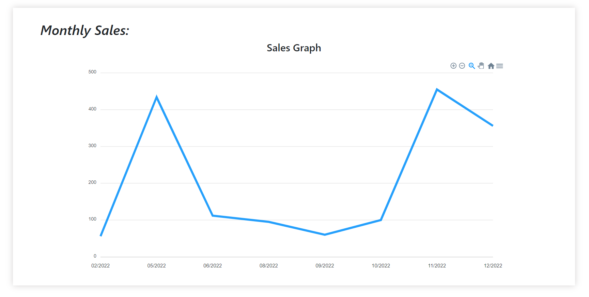
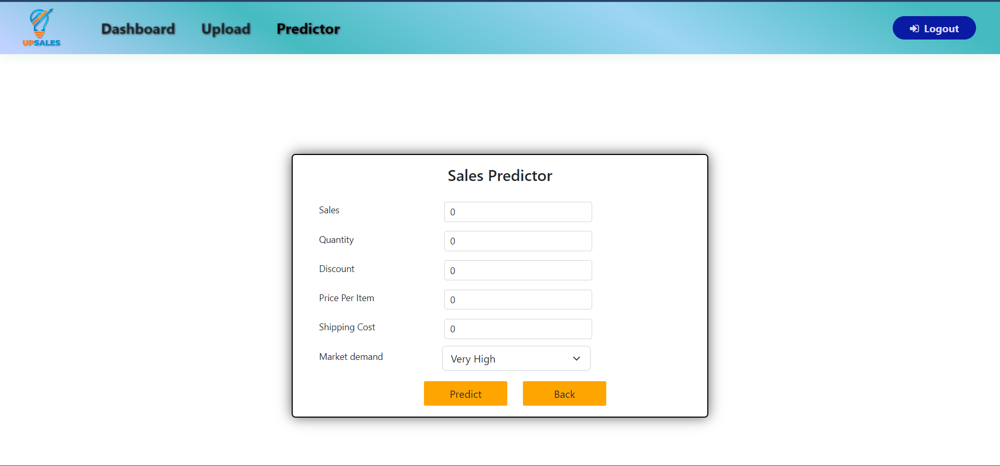

# Sensei Vivek
# Theme : FINeTech

<br>
<br>
<p align="center">

</p>

```
A solution for all sales managers around the world which can manage sales and predict the upcoming sales
```


# Features
<br>
<br>
<p align="center">

</p>

<br>
<br>
<p align="center">

</p>

<br>
<br>
<p align="center">

</p>

<br>
<br>
<p align="center">

</p>


## `Feature 1`

```
- The sales manager will input all the sales data ie item name, model number, category, quantity, & price per item 

- As a result the sales manager will get a personalized dashboard that will show everything related to his sales including his past
  sales record with a month-to-month detailed graph for easy understanding. 
```
<br>
<br>
<p align="center">

</p>
<br>
<br>
<p align="center">

</p>
<br>
<br>
<p align="center">

</p>

## `Feature 2`

```
- The most attractive feature of our website is the ML part where the sales manager can input some data and in return, he will receive 
  the predicted profits in sales in the near future.
  
- The required data to perform this action are sales, quantity, discount, shipping cost, Market Demand
```
<br>
<br>
<p align="center">

</p>


# Problems Solved
```
- Sales manager often has to carry record books along with to record ongoing sales and update meanwhile.If there is any minor mistake in 
  calculation or any writing error from him, he has to again perform the same calculations repeatedly. This was very Hectic.

-	For updating any record he has to perform many tasks before getting that record updated.

-	For this a website was created to manage everything for the sales manager thus making their life of his easier.So now we can add, 
        delete and edit any records from anywhere in the world.
```


# Problems Faced
```
- 	URL encryption was a big issue for the backend developer.

-	Managing data in the database was too hectic

- 	With respect to designing, a lot of time was invested to come up with the perfect final design.

-	Collecting and converting the files into SVG format was a tricky task.

- Managing the internal routing of react was one of the complicated tasks in which even one error could have stopped 
  the whole website from rendering.
  
-	In the sales prediction part, we faced issues with finding a good dataset to apply our Machine Algorithm on as well as applying 
  Machine Learning  Algorithm as a newbie was a challenging task
-	Converting Figma design to react using bootstrap was also challenging due to work load and the given time constrains.
```
# Team Members

### `Team lead- Vivek Kumar`
Vivek Acted as a **`Frontend developer`** as well as **`ML`** Developer 

```
Technologies Used by Vivek kumar
```
>CSS\
>Javascript\
>Bootstrap\
>React\
>Python\
>Node\
>Pandas\
>Numpy\
>Scikit learn\
>Matplot\


### `Swayam Behera`
Swayam contributed as **`UI/UX`** Designer
```
Technologies Used by Swayam Behera
```
>Figma\
>Adboe Illustrator\
>Adobe Photoshop\
>Adobe XD

### `Preet Khatri`
Preet contributed as **`Frontend Developer`**
```
Technologies Used by Preet Khatri
```
>HTMl\
>CSS\
>Javascript\
>Bootstrap\
>React


### `Mayur Valecha`
Mayur contributed as **`Backend Developer`**
```
Technologies Used by Mayur Valecha
```
>Javascript\
>Node\
>Express\
>MongoDB